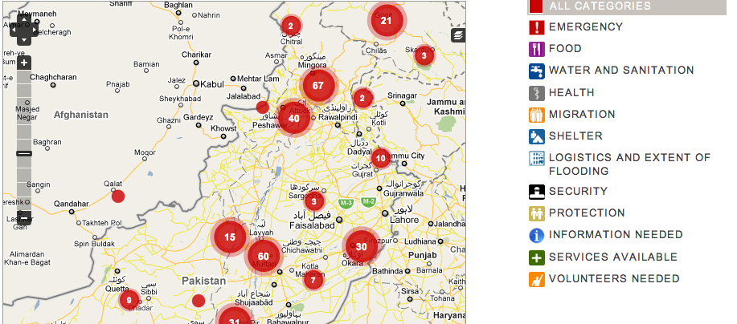

!SLIDE fp incremental center main
# Crowdsourcing #
## at  ##

### Brian P O'Rourke, Director of Engineering ###

.notes '

!SLIDE incremental

# agenda:

### What is Crowdsourcing? ###
### What sort of Crowdsourcing are we interested in? ###
### What can it be used for? ###
### Tools ###
### Lessons Learned ###
### Wrapup & Questions ###

!SLIDE center incremental

## What is crowdsourcing? ##

* An open call for work to be done by a crowd of people

!SLIDE incremental center

## What is crowdsourcing? ##

* Wikipedia
* 99 Designs
* reCAPTCHA

!SLIDE center

## What is crowdsourcing? ##

* Processing data using people
* because computers can't do it yet
* because people are better at it

.notes '

!SLIDE center incremental

## "Processing" data using people ##

* With the name of a company, transform it into a list of members of
  the board and their contact info.
* With a photograph of a person, tell us if they are exposing themself
* With an image, annotate it with a bounding box highlighting some
  object.
* With a paragraph of text, label the subjects, objects and verbs

!SLIDE clients center
# Who is using it now? #

  
 

* Data set generation
* Find and verify business listings
* Content moderation
* Sentiment analysis

!SLIDE center
# Who is using it now? #
## PakReport.org ##

!SLIDE center
<iframe src="http://pakreport.crowdflower.com"></iframe>

!SLIDE center
# Who is using it now? #
## NowTakeABow.com ##

<object width="640" height="385"><param name="movie" value="http://www.youtube.com/v/5-GFHMAbv_c?fs=1&amp;hl=en_US"></param><param name="allowFullScreen" value="true"></param><param name="allowscriptaccess" value="always"></param><embed src="http://www.youtube.com/v/5-GFHMAbv_c?fs=1&amp;hl=en_US" type="application/x-shockwave-flash" allowscriptaccess="always" allowfullscreen="true" width="640" height="385"></embed></object>

!SLIDE center
<iframe src="http://crowdflower.com/jobs/21166/preview"></iframe>

!SLIDE center
# Who is using it now? #
## The Wilderness Downtown ##

!SLIDE center
<iframe src="http://crowdflower.com/jobs/21140/preview"></iframe>

!SLIDE center

## Tools ##

* Quality control
* Data Validation
* Workflow Management
* Analysis and Reporting

!SLIDE center

## A Few Lessons Learned ##

* Quality is paramount
* Crowds create and solve problems - sometimes at the same time.
* On the Internet, no one knows you're a dog.
* On the Internet, no one knows you've just become a dog.
* Crowdsourcing as a blunt instrument

!SLIDE thanks center

# Thanks. Questions? #

## brian@crowdflower.com ##

### crowdflower.com/docs/api ###
### @crowdflower : github.com/dolores ###

!SLIDE

!SLIDE demo

# Demo time #

!SLIDE demo

<iframe src="http://faces.heroku.com"></iframe>

!SLIDE incremental demo
## CrowdFlower Platform ##

* ### Design ###
* ### Quality ###
* ### Channels ###

!SLIDE incremental demo
## Terms ##

* ### Job ###
* ### Unit ###
* ### Judgment ###

!SLIDE demo
## Ruby API Code ##
    @@@ ruby
    CrowdFlower.connect!(KEYS["crowdflower_key"])

    post "/faceit" do
      @job = CrowdFlower::Job.new(KEYS["job_id"])
      @unit = CrowdFlower::Unit.new(@job)
      @unit.create(JSON.parse(params[:data])).to_json
    end

!SLIDE demo
## Unit Data ##
    @@@ javascript
    {
      "images": ["http://images.google.com/images?q=tbn:dPRB21Eho0DGTM", ...],
      "source": "http://images.google.com/images?q=tbn:cs3VGWQHQBuCyM",
      "query": "Chris Van Pelt"
    }
    
!SLIDE demo
## CML ##
    @@@ html
    <h2>Source Image:</h2>
    <image src="{{source}}" />
    

    <cml:iterate on="images">
      <image src="{{images}}" />
      <cml:radios label="Same as source?" gold="true" validates="required">
        <cml:radio label="Yes"></cml:radio>
        <cml:radio label="No" checked="true"></cml:radio>
      </cml:radios>
    </cml:iterate>
    
!SLIDE demo

<iframe src="http://crowdflower.com/jobs/24647/preview?raw=true"></iframe>
    
!SLIDE demo

<iframe src="http://crowdflower.com/jobs/24647/preview"></iframe>

!SLIDE demo

<iframe src="https://crowdflower.com/jobs/24647/golds/41957821/edit"></iframe>

!SLIDE demo

<iframe src="https://crowdflower.com/judgments/amt/24647?override=true&amp;workerId=cvp"></iframe>

!SLIDE demo
## Unit Response ##
    @@@ javascript
    {
      "results": {
        "judgments": [{
          "worker_trust": 0.9,
          "city": "San Francisco",
          "external_type": "amt",
          "data": { ... },
          ...
        }, ... ],
        "same_as_source": {
          "agg": ["No", "Yes", "No", "Yes", "No", "No", "No", "No", "Yes", "No", "No", "No", "No", "Yes", "No", "No", "No", "No", "No", "Yes", "Yes", "No", "No", "No", "No", "No", "No", "No", "No", "No", "No"],
          "confidence": 0.734
        }
      },
      "data": { ... },
      "judgments_count": 3,
      ...
    }

!SLIDE demo center
## Programmatic Crowdsourcing ##

* break your data up into small pieces
* send it to the crowd for evaluation
* receive results via callbacks

!SLIDE demo center
## What else can you use it for? ##

* small units of work
* high volume
* automatically verifiable

!SLIDE

## That's pretty much it. ##

.notes '

